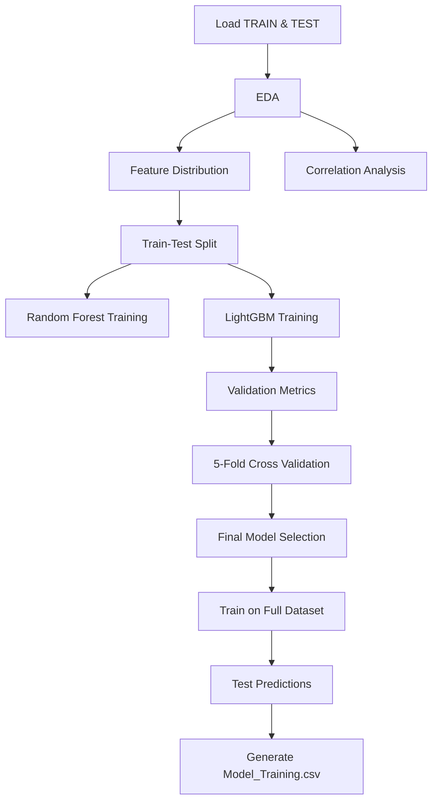

#  Device Fault Detection using LightGBM  
### IEEE SB GEHU ML Challenge

---

##  Problem Statement

The objective of this project is to build a **binary classification model** that predicts whether a device is:

- **0 → Normal**
- **1 → Faulty**

The dataset contains **47 numerical features (F01–F47)** generated by an embedded monitoring system.

This is a supervised tabular machine learning problem focused on **fault detection**.

---

##  Dataset Overview

- Features: 47 numerical variables (`F01 – F47`)
- Target Variable: `Class`
- Total Training Samples: **43,776**
- Binary Classification Task
- Stratified Train-Test Split: 80-20

### Class Distribution

| Class | Count | Percentage |
|-------|-------|------------|
| 0 (Normal) | 26,465 | 60.45% |
| 1 (Faulty) | 17,311 | 39.54% |

The dataset is moderately balanced and stratification was applied during splitting.

---

#  Exploratory Data Analysis (EDA)

### Data Quality
- No missing values
- No duplicate records
- All features are numeric

###  Statistical Summary
- Mean, standard deviation, min, max analyzed
- Variance comparison performed
- Identified high variance features

###  Distribution Analysis
KDE plots generated for high variance features:

```
F31, F38, F37, F32, F33,
F36, F30, F35, F34, F40, F19
```

Several features show strong separation between Normal and Faulty classes.

---

#  Correlation Analysis

- Pearson Correlation Matrix computed
- Heatmap visualization generated
- No extreme multicollinearity (>0.95) observed
- No dimensionality reduction required

---

#  Data Preprocessing

- Removed target column
- Stratified train-test split (80-20)
- Random State = 42 (Reproducibility)
- No scaling applied (tree-based models used)

---

#  Model 1: Random Forest

## Parameters
- n_estimators = 300
- max_depth = None
- min_samples_split = 2
- random_state = 42

## Performance

- Validation Accuracy: **98.46%**
- 5-Fold Cross Validation Accuracy: **98.21%**

---

#  Final Model: LightGBM

## Hyperparameters

```
n_estimators = 1000
learning_rate = 0.05
num_leaves = 31
subsample = 0.8
colsample_bytree = 0.8
random_state = 42
```

Gradient boosting outperformed Random Forest.

---

# 📈 Final Model Performance (LightGBM)

##  Validation Accuracy
**98.93%**

##  Classification Report

| Class | Precision | Recall | F1-Score |
|--------|-----------|--------|----------|
| 0 | 0.99 | 1.00 | 0.99 |
| 1 | 0.99 | 0.98 | 0.99 |

Balanced performance across both classes.

---

##  Confusion Matrix

```
[[5269   24]
 [  70 3393]]
```

### Interpretation
- False Positives: 24
- False Negatives: 70
- Extremely low misclassification rate

The model detects faulty devices with high sensitivity and precision.

---

#  Cross Validation

Stratified 5-Fold Cross Validation:

- Mean CV Accuracy: **~98.8%**

Small gap between validation and CV score → indicates strong generalization and minimal overfitting.

---

#  Feature Importance

LightGBM feature importance analysis shows that several high variance features contribute significantly to classification performance.

Important contributors include:

- F31
- F38
- F37
- F32
- F33
- F30

Tree-based models successfully captured nonlinear interactions among features.

---

#  End-to-End Pipeline



---

#  Final Submission Format

Predictions generated on `TEST.csv`:

```
ID,CLASS
1,0
2,1
3,0
...
```

File saved as:
```
FINAL_LGBM.csv
```

---

#  Technologies Used

- Python
- Pandas
- NumPy
- Seaborn
- Matplotlib
- Scikit-learn
- LightGBM
- Joblib

---

#  Key Strengths of This Project

✔ High Accuracy (~99%)  
✔ Balanced class performance  
✔ Very low false positives/negatives  
✔ Stable cross-validation  
✔ Proper stratification  
✔ Strong ensemble boosting approach  
✔ Reproducible pipeline  

---

#  Future Improvements

- ROC-AUC Curve visualization
- SHAP interpretability plots
- Optuna Hyperparameter tuning
- Threshold optimization
- Model deployment using FastAPI or Streamlit

---

#  Author

**Team Hashmap**  

---
