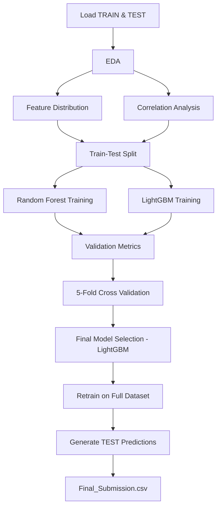

# Device Fault Detection
### IEEE SB GEHU ML alriEEEna — Round 1 | Team Hashmap
---

Streamlit App for Real-Time Experience : https://fault-detection-system-hashmap.streamlit.app/

## What We Built
We trained a machine learning model that looks at 47 sensor readings from a device and tells you whether it's running fine or about to cause trouble. Simple as that.

The model outputs:
- **0 → Normal** — all good
- **1 → Faulty** — something's wrong

---

## The Data

We got 43,776 labeled device readings to train on, each with 47 numerical features (F01–F47) collected by an embedded monitoring system. About 60% of devices were normal, 40% faulty — a reasonably balanced split, which made our job easier.

No missing values, no messy text columns. Clean data from the start.

---

## What We Found in EDA

Before touching any model, we explored the data to understand it. A few things stood out:

- Features like `F31, F38, F37, F32, F33` showed very clear separation between normal and faulty devices — basically the model's best clues.
- No features were so correlated with each other that we needed to drop any. All 47 made the cut.

---

## How We Built the Models

We kept preprocessing minimal — no scaling needed since we were going with tree-based models. Just split the data 80/20 (stratified, so both splits had similar class ratios) and started training.

**First, Random Forest** as a strong baseline:
```
n_estimators=300 · max_depth=None · random_state=42
```
It hit **98.46% validation accuracy** and **98.21% on 5-fold CV**. Solid — but we wanted more.

**Then LightGBM**, which is gradient boosting and typically outperforms Random Forest on structured data:
```
n_estimators=1000 · learning_rate=0.05 · num_leaves=31 · subsample=0.8
```
It reached **98.93% validation accuracy** and **~98.8% on CV**. Better, and it became our final model.

---

## Final Results

LightGBM trained on the full dataset performed extremely well:

| | Precision | Recall | F1 |
|--|--|--|--|
| Normal | 0.99 | 1.00 | 0.99 |
| Faulty | 0.99 | 0.98 | 0.99 |

Out of ~8,700 validation samples, we only misclassified **94 devices total** — 24 false alarms and 70 missed faults. For a fault detection system, that's a very comfortable margin.

The CV score being so close to validation accuracy tells us the model isn't just memorising the training data — it genuinely learned the pattern.

---

## Pipeline at a Glance



---

## Project Files

```
├── Dataset
        ├── TEST.csv        # Test data for submission
        ├── TRAIN.csv       # Training data for model
├── EDA.ipynb               # Exploration notebook
├── Final_Submission.csv    # Our predictions
├── Model_Training.ipynb    # Training & evaluation notebook
├── app.py                  #Streamlit app
├── lgb_model.pkl           # Saved model
└── README.md
```
## Usage Instruction
---
Using Streamlit App
https://fault-detection-system-hashmap.streamlit.app/

Drop in any CSV with `ID` and `F01–F47` columns. The app will predict each device's status, show you confidence scores, and let you download the results. If you have ground truth labels, it'll also show accuracy, F1, confusion matrix — the works.

---

## 🖥️ Running Locally (Manual Setup)

### 1. Clone the GitHub Repository

```bash
git clone https://github.com/ankitkumar-09/ML-alriEEEna
cd ML-alriEEEna
```

### 2. Install Dependencies

```bash
pip install -r requirements.txt
```

### 3. Explore the Data (Optional)

Open `EDA.ipynb` to explore the dataset and visualizations:

```bash
jupyter notebook EDA.ipynb
```

### 4. Train the Model (Optional)

Open `Model_Training.ipynb` to retrain the LightGBM model:

```bash
jupyter notebook Model_Training.ipynb
```

> The pre-trained model is already saved as `lgb_model.pkl` — you can skip this step if you just want to run predictions.

### 5. Swap in Your Test CSV

Inside `Model_Training.ipynb`, locate:

```python
df = pd.read_csv("your_test_file.csv")
```

Replace it with the path to your own CSV file containing `ID` and `F01–F47` columns.

### 6. Run the Streamlit App Locally

```bash
streamlit run app.py
```

Then open [http://localhost:8501](http://localhost:8501) in your browser.

---

## Stack

Python · Pandas · NumPy · Scikit-learn · LightGBM · Matplotlib · Seaborn · Joblib · Streamlit

---

**Team Hashmap** — built for IEEE SB GEHU ML alriEEEna
